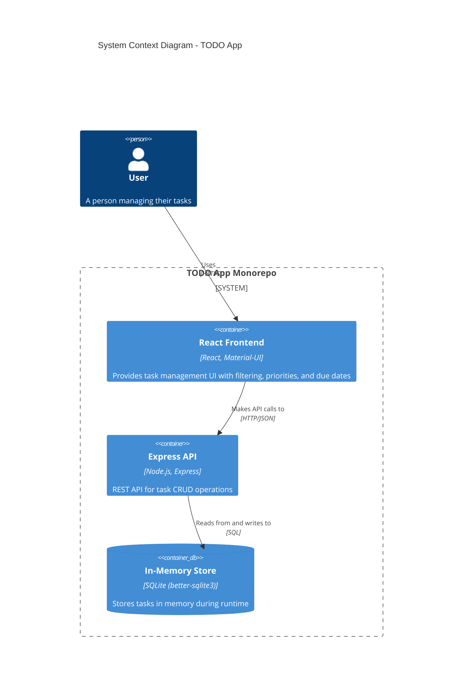
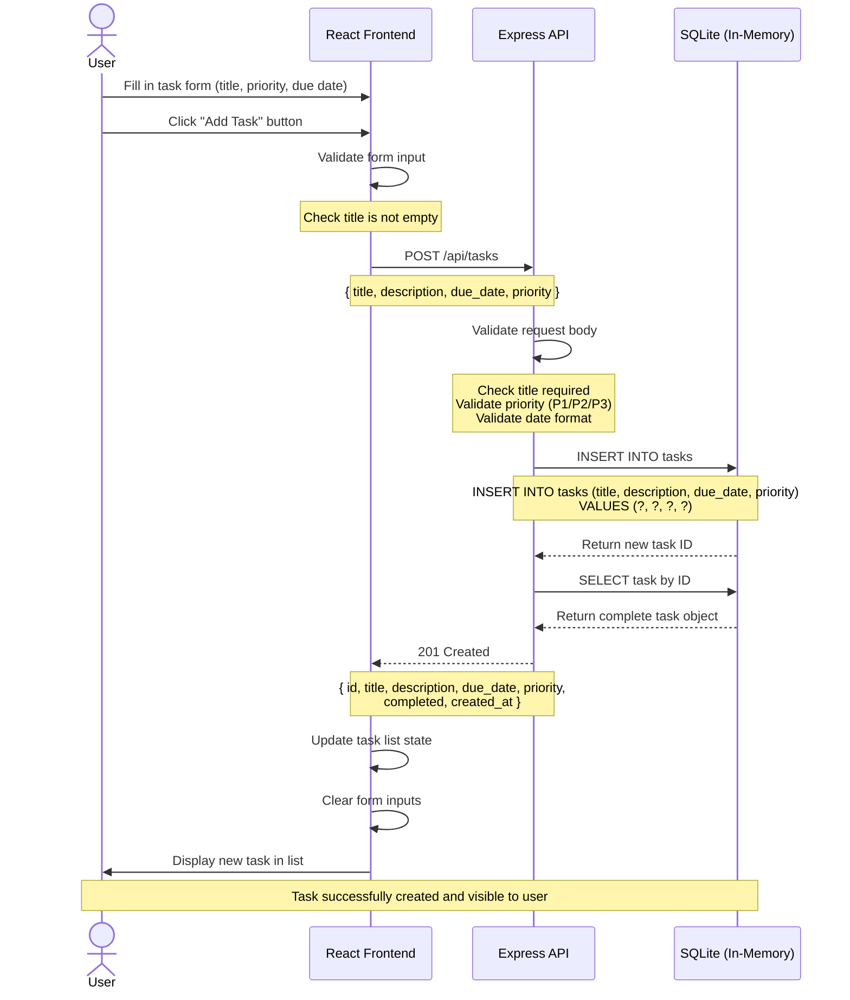

# Cloud Architecture Overview

## System Context

This document provides a high-level overview of the TODO App architecture, which is organized as a monorepo containing both frontend and backend components.

## Architecture Diagram

## Sequence Diagram - Creating a TODO

The following sequence diagram illustrates the interaction flow when a user creates a new TODO task:

## Components

### Frontend (`packages/frontend`)
- **Technology**: React 18, Material-UI (MUI)
- **Purpose**: Single-page application providing task management interface
- **Key Features**:
  - Task creation, editing, and deletion
  - Due date and priority assignment
  - Filter views (All, Today, Overdue)
  - Responsive UI with Material Design
- **Communication**: REST API calls to Express backend

### Backend (`packages/backend`)
- **Technology**: Node.js, Express, better-sqlite3
- **Purpose**: REST API server for task operations
- **Key Features**:
  - CRUD endpoints for tasks
  - Data validation
  - Query filtering and sorting
  - CORS support for local development
- **Communication**: HTTP/JSON REST API

### Data Store
- **Technology**: SQLite (in-memory)
- **Purpose**: Ephemeral task storage during application runtime
- **Characteristics**:
  - No persistence across server restarts
  - Suitable for development and demonstration
  - Fast read/write operations
  - SQL-based querying and sorting

## Data Flow

1. **User Interaction**: User interacts with React frontend in the browser
2. **API Request**: Frontend sends HTTP requests to Express backend (e.g., POST /api/tasks)
3. **Data Processing**: Backend validates and processes the request
4. **Database Operation**: Backend executes SQL queries against in-memory SQLite database
5. **Response**: Backend returns JSON response to frontend
6. **UI Update**: Frontend updates the view with the new data

## Deployment Considerations

### Current Setup (Development)
- Monorepo structure with shared workspace
- Frontend and backend run on separate ports
- In-memory database resets on server restart
- No persistence layer

### Future Considerations (Post-MVP)
- Replace in-memory SQLite with persistent database (PostgreSQL, MySQL)
- Deploy frontend as static site (Vercel, Netlify, S3)
- Deploy backend as containerized service (Docker, Kubernetes)
- Add environment-based configuration
- Implement proper authentication and authorization
- Add caching layer (Redis) for improved performance
- Set up CI/CD pipeline

## Technology Stack Summary

| Layer | Technology | Purpose |
|-------|-----------|---------|
| Frontend | React 18 | UI framework |
| UI Components | Material-UI (MUI) | Component library |
| Backend | Express.js | Web server framework |
| Runtime | Node.js | JavaScript runtime |
| Database | SQLite (better-sqlite3) | In-memory data store |
| Package Manager | npm/yarn | Dependency management |
| Monorepo Structure | npm workspaces | Multi-package management |

## API Endpoints

| Method | Endpoint | Description |
|--------|----------|-------------|
| GET | /api/tasks | List all tasks (with optional filtering) |
| POST | /api/tasks | Create a new task |
| GET | /api/tasks/:id | Get a specific task |
| PUT | /api/tasks/:id | Update a task |
| PATCH | /api/tasks/:id | Partial update (e.g., toggle completion) |
| DELETE | /api/tasks/:id | Delete a task |

## Security Considerations

### Current State
- No authentication or authorization
- CORS enabled for local development
- No input sanitization beyond basic validation
- No rate limiting

### Recommended Improvements
- Implement user authentication (JWT, OAuth)
- Add request validation middleware (express-validator)
- Implement rate limiting (express-rate-limit)
- Add input sanitization to prevent SQL injection
- Use HTTPS in production
- Implement CSRF protection
- Add logging and monitoring
